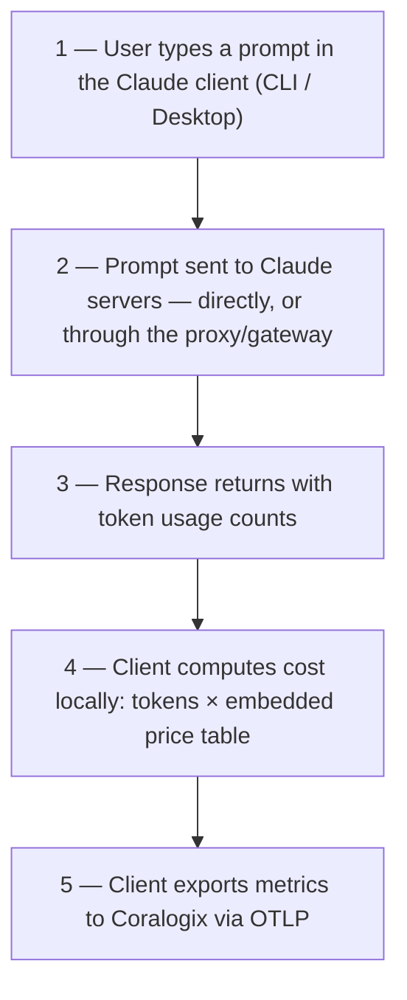

# Proxies, gateways & third-party providers — why managed telemetry stops working

If a developer's Claude Code routes through **any** proxy, router, gateway, or third-party model provider, Claude Code treats it as a *third-party provider* and **silently stops applying server-managed (dashboard) settings** — including the OpenTelemetry configuration from [Option A in the README](README.md#option-a--org-wide-via-claude-code-managed-settings-recommended-for-teams). That user's telemetry disappears from Coralogix with no error anywhere.

This page explains the mechanism, lists the software that triggers it, and documents the two delivery channels that keep telemetry flowing (verified experimentally, July 2026, Claude Code 2.1.207).

---

## The mechanism

Per [Anthropic's server-managed settings documentation](https://code.claude.com/docs/en/server-managed-settings#platform-availability):

> "Server-managed settings are **not available** when using third-party model providers: … Custom API endpoints via `ANTHROPIC_BASE_URL` or third-party LLM gateways."

And from the same page's security-considerations table:

> "User configures a third-party model provider → **Server-managed settings are bypassed.** This includes setting `CLAUDE_CODE_USE_BEDROCK`, `CLAUDE_CODE_USE_MANTLE`, `CLAUDE_CODE_USE_VERTEX`, `CLAUDE_CODE_USE_FOUNDRY`, `CLAUDE_CODE_USE_ANTHROPIC_AWS`, or a **non-default `ANTHROPIC_BASE_URL`**."

Every tool in the next section works by setting a custom `ANTHROPIC_BASE_URL` (or one of the provider flags) — so installing any of them turns off dashboard-delivered telemetry for that user.

---

## Software that triggers the bypass

### Claude Code routers / cost proxies (the Headroom family)

- Headroom
- claude-code-router (musistudio)
- claude-code-proxy (fuergaosi233)
- claude-code-proxy (1rgs)
- y-router
- ccflare

### AI gateways / LLM proxies

- LiteLLM
- Portkey
- OpenRouter
- Cloudflare AI Gateway
- Helicone — *proxy mode only* (its async-logging mode does **not** trigger the bypass)
- Kong AI Gateway
- Apache APISIX
- TrueFoundry
- Requesty
- Vercel AI Gateway
- Braintrust
- Martian

### Provider flags — deliberate enterprise deployments

- Amazon Bedrock — `CLAUDE_CODE_USE_BEDROCK`
- Bedrock Mantle — `CLAUDE_CODE_USE_MANTLE`
- Google Vertex AI — `CLAUDE_CODE_USE_VERTEX`
- Microsoft Foundry — `CLAUDE_CODE_USE_FOUNDRY`

---

## The fix: deliver OTel env vars through a surviving channel

Two configuration channels are still applied even when the bypass is active. Each was verified in a separate experiment: with a real proxy active (`ANTHROPIC_BASE_URL` pointing at a local Headroom instance) and every other telemetry source removed, Claude Code still reported `isTelemetryEnabled=true` and exported metrics — once sourced from `managed-settings.json` alone, and once from the user's `~/.claude/settings.json` alone.

### Option 1 — `managed-settings.json` via IT/MDM software (recommended for fleets)

Deploy the file with whatever endpoint-management software your org uses, for example:

- **Jamf Pro** / Kandji / Mosyle / Omnissa Workspace ONE (macOS)
- **Microsoft Intune** (macOS and Windows)
- **Windows Group Policy** (registry-based policy or file drop)

File locations:

| Platform | Path |
|---|---|
| macOS | `/Library/Application Support/ClaudeCode/managed-settings.json` |
| Windows | `C:\Program Files\ClaudeCode\managed-settings.json` |
| Linux / WSL | `/etc/claude-code/managed-settings.json` |

On macOS, Jamf can alternatively push a **configuration profile** targeting the `com.anthropic.claudecode` managed-preferences domain (same keys, plist format) — harder for users to tamper with than a file.

Use the same `env` block as the README's Option A:

```json
{
  "env": {
    "CLAUDE_CODE_ENABLE_TELEMETRY": "1",
    "OTEL_METRICS_EXPORTER": "otlp",
    "OTEL_LOGS_EXPORTER": "otlp",
    "OTEL_EXPORTER_OTLP_PROTOCOL": "http/protobuf",
    "OTEL_EXPORTER_OTLP_ENDPOINT": "<YOUR_CX_OTLP_ENDPOINT>",
    "OTEL_EXPORTER_OTLP_HEADERS": "Authorization=Bearer <YOUR_CX_API_KEY>",
    "OTEL_RESOURCE_ATTRIBUTES": "cx.application.name=claude-code,cx.subsystem.name=claude-code-sessions",
    "OTEL_EXPORTER_OTLP_METRICS_TEMPORALITY_PREFERENCE": "delta"
  }
}
```

### Option 2 — per-user `~/.claude/settings.json`

The same `env` block placed in the user's own `~/.claude/settings.json` also survives the bypass (this is the README's [Option B settings-file variant](README.md#option-b--per-developer-setup)). Suitable for individuals or small teams without MDM; not tamper-resistant and must be set up per machine.

> **Restart required:** OpenTelemetry configuration is an "advanced" setting — users must fully restart Claude Code for the env block to take effect.

---

## Settings priority — why this works cleanly

Claude Code applies settings in this order ([official precedence documentation](https://code.claude.com/docs/en/settings#settings-precedence)):

1. **Managed** (highest — cannot be overridden by anything)
2. Command-line arguments
3. Local (`.claude/settings.local.json`)
4. Project (`.claude/settings.json`)
5. User (`~/.claude/settings.json`)

Within the **managed tier**, per the [server-managed settings documentation](https://code.claude.com/docs/en/server-managed-settings#settings-precedence):

> "Claude Code uses the **first source that delivers a non-empty configuration**. Server-managed settings are checked first, then endpoint-managed settings. **Sources don't merge.**"

So the order inside the managed tier is: `policyHelper` (if configured) → **server-managed (dashboard)** → **endpoint-managed (`managed-settings.json`)**.

This is exactly why the MDM file is the right complement to the dashboard:

- **Users without a proxy** → dashboard settings load and win; the MDM file is ignored — no conflict, no double configuration.
- **Users with a proxy** → dashboard settings are bypassed (deliver nothing), so the MDM file activates and fills the gap.

Two caveats that follow from "sources don't merge":

1. **The dashboard configuration must also contain the OTel env vars.** For non-proxy users the dashboard config wins *entirely* — if it exists but lacks the telemetry block, the MDM file is silently ignored and those users send nothing. Deploying only the MDM file does not cover them.
2. Any *other* policy keys you put in `managed-settings.json` are likewise ignored for non-proxy users. Keep the file scoped to the telemetry env block.

---

## How cost data reaches Coralogix



The critical detail: **cost is calculated on the user's machine**, by the Claude Code client itself. Anthropic's servers report only *token counts* in each response; the client multiplies them by a **price list embedded in the client binary** and exports the result (`claude_code.cost.usage`, `claude_code.token.usage`) to Coralogix.

---

## Cost accuracy caveats

Because cost is computed client-side from an embedded public price table, the `claude_code_cost_usage_USD_total` numbers in Coralogix are **estimates**, and can differ from the actual Anthropic invoice:

### a. Outdated clients compute outdated prices

The price table ships inside the client. A user running an old Claude Code version calculates with old prices — every price change (new models, price cuts, promotions) is wrong until they update. Keep clients up to date fleet-wide.

### b. Sonnet 5 promotional pricing (until August 31, 2026)

Claude Sonnet 5 has introductory pricing of **$2 / $10 per million tokens** (input/output) through **2026-08-31**, versus its list price of **$3 / $15**. Clients whose embedded table doesn't reflect the promotion calculate at full list price — reporting **1.5× the actual billed cost** (a 50% overstatement) for Sonnet 5 usage during the promotional period.

### c. US data-residency orgs pay 1.1× — the client doesn't know

Organizations with regulatory or compliance requirements can pin Claude inference to US infrastructure ([data residency](https://platform.claude.com/docs/en/manage-claude/data-residency), the `inference_geo: "us"` request option, supported on Claude Opus 4.6 / Sonnet 4.6 and later models). Those requests are billed at a **1.1× multiplier on every token category** — input, output, cache reads, and cache writes.

The client's embedded price table uses standard global-endpoint prices and **does not apply the 1.1× multiplier**. For US-geo organizations, Coralogix cost is therefore **understated by ~10%**.

### d. Negotiated organization pricing is not reflected

If your organization has special contractual pricing with Anthropic (enterprise discounts, committed-use rates), the client knows nothing about it — it always calculates with the full public list prices.

> **Bottom line:** treat Coralogix cost metrics as directionally correct usage telemetry — excellent for trends, per-team breakdowns, and anomaly detection. For billing-accurate spend, use the Anthropic Console / invoice.

---

## References

- [Server-managed settings — bypass conditions & precedence](https://code.claude.com/docs/en/server-managed-settings)
- [Settings reference — precedence & managed-settings.json paths](https://code.claude.com/docs/en/settings)
- [Monitoring usage (OpenTelemetry configuration)](https://code.claude.com/docs/en/monitoring-usage)
- [Data residency & regional pricing](https://platform.claude.com/docs/en/manage-claude/data-residency)
- Headroom maintainers on Claude Desktop support: [issue #528](https://github.com/headroomlabs-ai/headroom/issues/528), [discussion #587](https://github.com/headroomlabs-ai/headroom/discussions/587)
