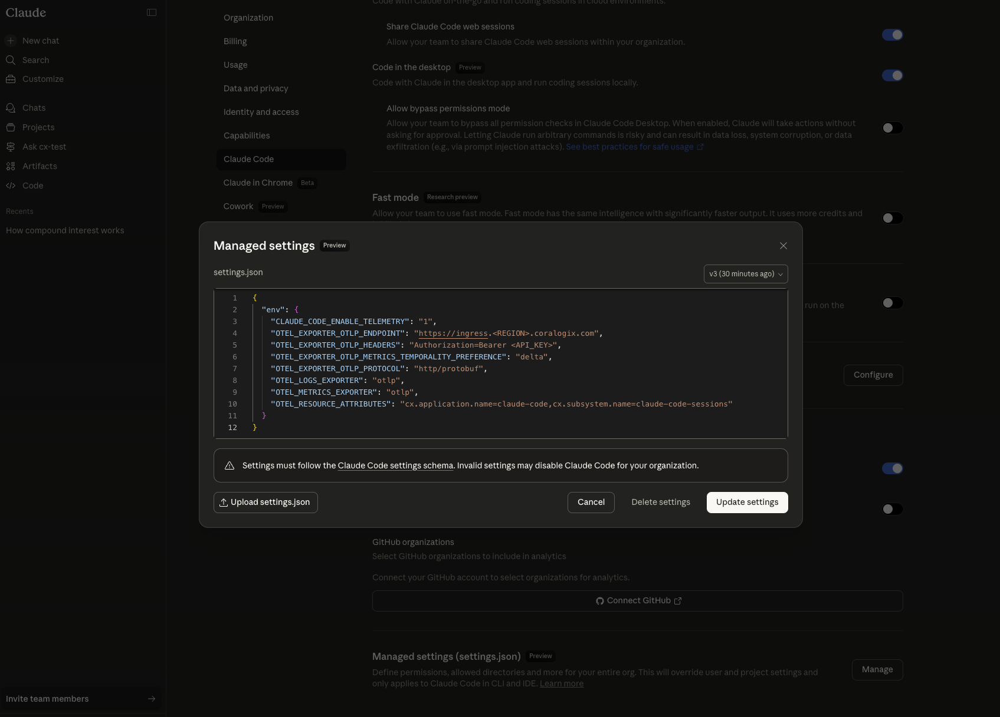
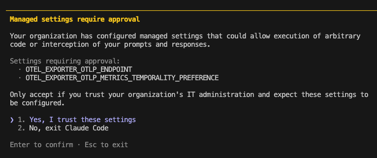
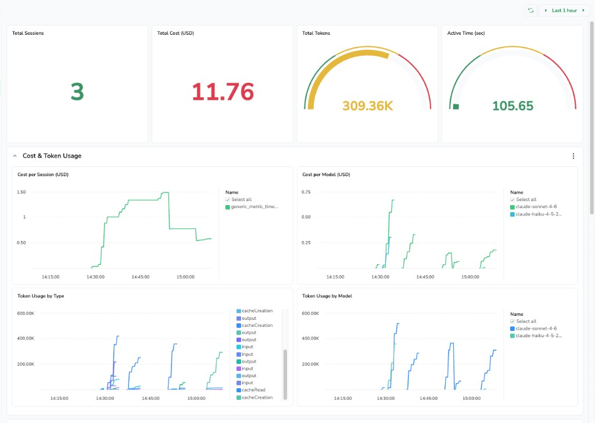

# Claude Code - Coralogix

Ship every Claude Code session — token usage, costs, code changes, tool decisions, and prompt logs — directly into Coralogix using Claude Code's built-in OpenTelemetry support.

No agents. No wrappers. No code changes to your projects. Claude Code emits OTLP natively; you just point it at your Coralogix ingress endpoint.

---

## How it works

Claude Code exposes telemetry via the [OpenTelemetry SDK](https://docs.anthropic.com/en/docs/claude-code/monitoring-usage) when `CLAUDE_CODE_ENABLE_TELEMETRY=1` is set. This repo provides:

- `activate.sh` — exports all required env vars into your shell in one step
- `.env` — stores your Coralogix API key and endpoint (git-ignored)
- `coralogix-dashboard.json` — a pre-built dashboard ready to import

---

## Signals sent to Coralogix

### Metrics

All metrics use **delta temporality** — the format Coralogix expects for counters. They show up under **Metrics Explorer** when you search `claude_code`.

| Metric | Labels | What it tracks |
|---|---|---|
| `claude_code_session_count_total` | `session_id`, `user_account_uuid` | Sessions started |
| `claude_code_token_usage_tokens_total` | `model`, `type` | Tokens by model and type (`input`, `output`, `cacheRead`, `cacheCreation`) |
| `claude_code_cost_usage_USD_total` | `model` | Estimated USD cost per model |
| `claude_code_lines_of_code_count_total` | `type` | Lines added and removed |
| `claude_code_commit_count_total` | — | Git commits made |
| `claude_code_pull_request_count_total` | — | Pull requests created |
| `claude_code_code_edit_tool_decision_total` | `decision`, `source`, `tool_name`, `language` | Accept / reject on code edits |
| `claude_code_active_time_total_s_total` | `type` | Seconds Claude was actively processing (`cli` = AI/tool work, `user` = keyboard interaction) |

### Log events

Log events are routed to the subsystem you configure in `.env`. Query them in **Coralogix Logs** using DataPrime or Lucene.

| Event type | Key attributes |
|---|---|
| `claude_code.user_prompt` | `session.id`, `user.account_uuid`, `prompt` (opt-in), `model` |
| `claude_code.api_request` | `model`, token counts, cost, latency |
| `claude_code.api_error` | `status`, error message |
| `claude_code.tool_result` | tool name, duration, outcome, `tool_parameters` (JSON — Bash: `bash_command`, `full_command`, `description`; MCP/Skill: opt-in via `OTEL_LOG_TOOL_DETAILS=1`) |
| `claude_code.tool_decision` | tool name, `decision`, `source` |

Every signal carries `session.id`, `user.account_uuid`, `user.email`, `organization.id`, `app.version`, and `terminal.type`.

---

## Setup

There are two deployment paths depending on whether you need org-wide automatic rollout or per-developer setup.

---

### Option A — Org-wide via Claude Code Managed Settings (recommended for teams)

Claude Code's [server-managed settings](https://docs.anthropic.com/en/docs/claude-code/managed-settings) (Public Beta) lets you push the Coralogix configuration to every developer in your organization automatically. No shell scripts, no `.env` distribution, no per-developer action required.

**Requirements:** Claude for Teams or Enterprise · Claude Code ≥ 2.1.38

#### 1. Open the admin console

In [Claude.ai](https://claude.ai/), navigate to **Admin Settings → Claude Code → Managed Settings** and click **Manage**.

#### 2. Paste the settings JSON

```json
{
  "env": {
    "CLAUDE_CODE_ENABLE_TELEMETRY": "1",
    "OTEL_METRICS_EXPORTER": "otlp",
    "OTEL_LOGS_EXPORTER": "otlp",
    "OTEL_EXPORTER_OTLP_PROTOCOL": "http/protobuf",
    "OTEL_EXPORTER_OTLP_ENDPOINT": "<YOUR_CX_OTLP_ENDPOINT>",
    "OTEL_EXPORTER_OTLP_HEADERS": "Authorization=Bearer <YOUR_CX_API_KEY>",
    "OTEL_RESOURCE_ATTRIBUTES": "cx.application.name=claude-code,cx.subsystem.name=claude-code-sessions",
    "OTEL_EXPORTER_OTLP_METRICS_TEMPORALITY_PREFERENCE": "delta"
  }
}
```

Replace the placeholders with your values (see the credentials section below for OTLP endpoint by region).

#### 3. Click "Add settings"



Settings are delivered to all Claude Code clients at their next startup, or within the hourly polling cycle for running sessions.

#### What developers experience

On their next `claude` startup, developers see a one-time security approval dialog listing the env vars being configured by the org. They select **Yes, I trust these settings** and Claude Code restarts. Telemetry flows from that point forward — no further action needed.



> **Note on OTEL and restarts:** OpenTelemetry configuration takes effect on a full Claude Code restart, not just session reload. After the approval dialog, Claude Code restarts automatically.

---

### Option B — Per-developer setup

Use this if your organization is not on Claude for Teams/Enterprise, or if you prefer not to use server-managed settings.

#### 1. Configure your Coralogix credentials

```bash
cp .env.example .env
```

Open `.env` and fill in:

```
CX_API_KEY=<your-send-your-data-api-key>
CX_OTLP_ENDPOINT=https://ingress.eu1.coralogix.com
CX_APPLICATION_NAME=claude-code
CX_SUBSYSTEM_NAME=claude-code-sessions
```

Find your Send-Your-Data API key under **Settings → API Keys** in your Coralogix tenant.

**OTLP ingress by region:**

| Domain | OTLP endpoint |
|---|---|
| `us1.coralogix.com` | `https://ingress.us1.coralogix.com` |
| `us2.coralogix.com` | `https://ingress.us2.coralogix.com` |
| `eu1.coralogix.com` | `https://ingress.eu1.coralogix.com` |
| `eu2.coralogix.com` | `https://ingress.eu2.coralogix.com` |
| `ap1.coralogix.com` | `https://ingress.ap1.coralogix.com` |
| `ap2.coralogix.com` | `https://ingress.ap2.coralogix.com` |
| `ap3.coralogix.com` | `https://ingress.ap3.coralogix.com` |

#### 2. Activate telemetry and start Claude

```bash
source activate.sh
claude
```

`activate.sh` exports all OTEL variables into your current shell. It must be sourced (not executed) so the variables persist. Re-run it in each new terminal, or make it permanent as below.

#### 3. Make it permanent

Add the following to `~/.zshrc` (or `~/.bashrc`) so every terminal automatically has telemetry enabled:

```bash
if [ -f "$HOME/path/to/claude-code-coralogix/.env" ]; then
  set -a; source "$HOME/path/to/claude-code-coralogix/.env"; set +a
fi
export CLAUDE_CODE_ENABLE_TELEMETRY=1
export OTEL_METRICS_EXPORTER=otlp
export OTEL_LOGS_EXPORTER=otlp
export OTEL_EXPORTER_OTLP_PROTOCOL=http/protobuf
export OTEL_EXPORTER_OTLP_ENDPOINT="${CX_OTLP_ENDPOINT}"
export OTEL_EXPORTER_OTLP_HEADERS="Authorization=Bearer ${CX_API_KEY}"
export OTEL_RESOURCE_ATTRIBUTES="cx.application.name=${CX_APPLICATION_NAME},cx.subsystem.name=${CX_SUBSYSTEM_NAME}"
export OTEL_EXPORTER_OTLP_METRICS_TEMPORALITY_PREFERENCE=delta
```

Alternatively, use Claude Code's own [settings file](https://docs.anthropic.com/en/docs/claude-code/settings) at `~/.claude/settings.json`:

```json
{
  "env": {
    "CLAUDE_CODE_ENABLE_TELEMETRY": "1",
    "OTEL_METRICS_EXPORTER": "otlp",
    "OTEL_LOGS_EXPORTER": "otlp",
    "OTEL_EXPORTER_OTLP_PROTOCOL": "http/protobuf",
    "OTEL_EXPORTER_OTLP_ENDPOINT": "https://ingress.eu1.coralogix.com",
    "OTEL_EXPORTER_OTLP_HEADERS": "Authorization=Bearer <YOUR_CX_API_KEY>",
    "OTEL_RESOURCE_ATTRIBUTES": "cx.application.name=claude-code,cx.subsystem.name=claude-code-sessions",
    "OTEL_EXPORTER_OTLP_METRICS_TEMPORALITY_PREFERENCE": "delta"
  }
}
```

---

## Pre-built dashboard

Import `coralogix-dashboard.json` for an instant view of all signals.



**Sections:**

| Section | What you see |
|---|---|
| **KPI Bar** | Sessions · Cost · Tokens · Active Time · Lines Changed · Commits — all as number cards |
| **Session Activity** | Sessions over time · Avg duration · Tokens per session |
| **Cost & Token Breakdown** | Cost/session · Cost by model · Tokens by model · Tokens by type · API token volume · Cost per token |
| **Code Impact** | Lines added/removed by type · Commits over time · Aggregate line changes |
| **Code Edit Behaviour** | Acceptance rate arc gauge · Decisions by type · Decision volume over time |
| **Prompt Log** | Live DataPrime table — timestamp · user · session · model · prompt text |

**To import:**
1. In your Coralogix tenant go to **Dashboards → New Dashboard**
2. Click the menu icon → **Import from JSON**
3. Paste the contents of `coralogix-dashboard.json` and save

---

## Advanced configuration

| Variable | Default | Purpose |
|---|---|---|
| `OTEL_METRIC_EXPORT_INTERVAL` | `60000` ms | How often metrics are flushed — lower to `10000` when testing |
| `OTEL_LOGS_EXPORT_INTERVAL` | `5000` ms | Log flush interval |
| `OTEL_LOG_USER_PROMPTS` | off | Set to `1` to include prompt text in `claude_code.user_prompt` log events |
| `OTEL_LOG_TOOL_DETAILS` | off | Set to `1` to add MCP server and tool names to tool events |
| `OTEL_RESOURCE_ATTRIBUTES` | — | Add custom dimensions, e.g. `team=platform,env=prod` |
| `OTEL_METRICS_INCLUDE_SESSION_ID` | `true` | Attaches `session.id` to metric labels — disable to reduce cardinality |
| `OTEL_METRICS_INCLUDE_ACCOUNT_UUID` | `true` | Attaches `user.account_uuid` to metric labels |

---

## Privacy & sensitive data

The following fields may contain sensitive data:

- `tool_parameters` (`claude_code.tool_result`) — always emitted for Bash tool; includes `bash_command`, `full_command`, and `description`. Most likely source of sensitive data — commands may contain secrets, file paths, or internal URLs. No opt-out. MCP/Skill tools only emit this field when `OTEL_LOG_TOOL_DETAILS=1`
- `prompt` (`claude_code.user_prompt`) — only collected when `OTEL_LOG_USER_PROMPTS=1` (off by default)
- `user.email` — present on all events when authenticated via OAuth
- `user.account_uuid` — present on all events
- `organization.id` — present on all events
- `error message` (`claude_code.api_error`) — present on API failures; contents not fully documented and may include fragments of the failed request

To drop a field entirely before it is indexed, use a [Coralogix Parsing Rule](https://coralogix.com/docs/log-parsing-rules/) with the **Remove Field** action.

---

## Metric cardinality

Each metric label combination creates a unique time series in Coralogix. High-cardinality labels can increase costs. The main sources:

- `session_id` — a new value per Claude session; attached to `claude_code_session_count_total` and `claude_code_token_usage_tokens_total`. Disable with `OTEL_METRICS_INCLUDE_SESSION_ID=false`
- `user_account_uuid` — one value per developer. Disable with `OTEL_METRICS_INCLUDE_ACCOUNT_UUID=false`
- `model` — low cardinality, changes only when Anthropic releases new models

---

## References

- [Claude Code overview](https://docs.anthropic.com/en/docs/claude-code/overview) — what Claude Code is and how to get started
- [Monitoring usage (OpenTelemetry)](https://docs.anthropic.com/en/docs/claude-code/monitoring-usage) — full reference for telemetry signals, env vars, and OTLP configuration
- [Settings](https://docs.anthropic.com/en/docs/claude-code/settings) — `settings.json` schema and all supported configuration keys
- [Managed settings](https://docs.anthropic.com/en/docs/claude-code/managed-settings) — org-wide configuration via the Claude.ai admin console (Teams/Enterprise)
- [Security and privacy](https://docs.anthropic.com/en/docs/claude-code/security) — data handling, permissions, and trust model
