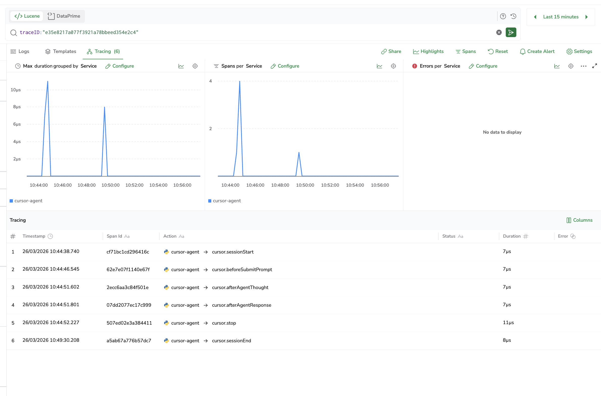
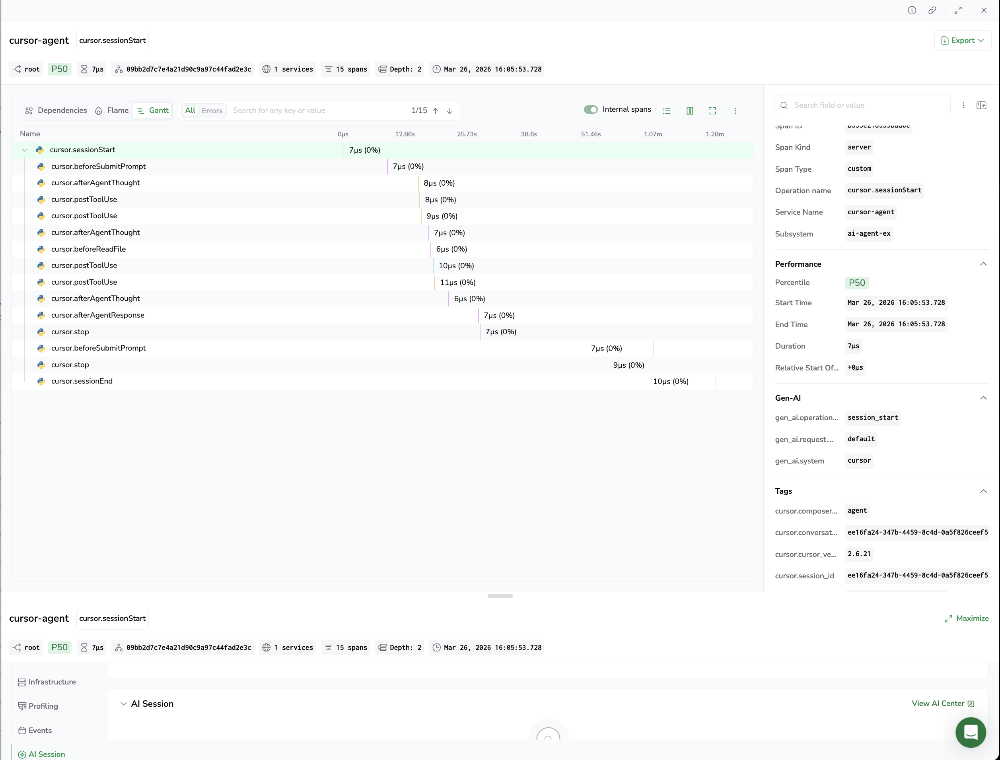

# Cursor - Coralogix

Ship every Cursor agent session — prompts, tool calls, shell executions, file edits, and MCP calls — directly into Coralogix as OTLP traces.

No wrappers. No code changes. Uses Cursor's native agent hooks system; a Python script converts each event to an OTLP protobuf span and POSTs it to your Coralogix ingress endpoint.

---

## How it works

Cursor exposes a `~/.cursor/hooks.json` file that registers shell commands to be called at every agent lifecycle event. Each hook receives a JSON payload on stdin describing the event.

```
Cursor agent event
      │
      ▼
~/.cursor/hooks/coralogix_hook.sh   (wrapper, loads credentials)
      │
      ▼
extension/resources/hook.py         (Python: stdin → OTLP protobuf span → POST /v1/traces)
      │
      ▼
Coralogix OTLP endpoint
```

All spans within a session share the same `traceId`, with `cursor.sessionStart` as the root span. A full agent run appears as a single trace in Coralogix Visual Explorer.

---

## Deployment options

| | Audience | How |
|---|---|---|
| **Install script** (`install.sh`) | Individual install or org-wide using MDM | CLI flags, env vars, or a `.env` file |
| **Extension** (`.vsix`) | Individual / GUI | Install in Cursor, enter credentials in Settings UI |

---

## Option 1 — Install script

Works for both local setup and org-wide MDM deployment (Jamf, Intune, Ansible, etc.).

### Local setup with a .env file

Create a `.env` file with your credentials:

```
CX_API_KEY=<your-send-your-data-api-key>
CX_OTLP_ENDPOINT=https://ingress.eu2.coralogix.com
CX_APPLICATION_NAME=cursor
CX_SUBSYSTEM_NAME=ai-agent

# Optional
# Set to true to replace all prompt and response text with [MASKED] before sending to Coralogix
CURSOR_MASK_PROMPTS=false
CURSOR_OMIT_PRE_TOOL_USE_SPANS=false
CX_OTLP_DEBUG=false
```

Then run:

```bash
./install.sh --env-file .env
```

### Local setup with flags

```bash
./install.sh --api-key <key> --endpoint https://ingress.eu2.coralogix.com
```

### MDM / automated deployment

Inject credentials via environment variables from your secrets manager:

```bash
CX_API_KEY=xxx CX_OTLP_ENDPOINT=xxx ./install.sh
```

### All options

```bash
./install.sh \
  --api-key       <key>      # required (or CX_API_KEY env var)
  --endpoint      <url>      # optional, default: https://ingress.eu2.coralogix.com
  --application   <name>     # optional, default: cursor
  --subsystem     <name>     # optional, default: ai-agent
  --mask-prompts             # optional, replace prompts with [MASKED]
  --omit-pre-tool-use        # optional, skip preToolUse spans
  --debug                    # optional, print span IDs to stderr
  --env-file      <path>     # optional, load credentials from a .env file
```

### Uninstall

```bash
./install.sh --uninstall
```

The script is idempotent — safe to re-run on every provisioning cycle.

**OTLP ingress by region:**

| Domain | OTLP endpoint |
|---|---|
| `us1.coralogix.com` | `https://ingress.us1.coralogix.com` |
| `us2.coralogix.com` | `https://ingress.us2.coralogix.com` |
| `eu1.coralogix.com` | `https://ingress.eu1.coralogix.com` |
| `eu2.coralogix.com` | `https://ingress.eu2.coralogix.com` |
| `ap1.coralogix.com` | `https://ingress.ap1.coralogix.com` |
| `ap2.coralogix.com` | `https://ingress.ap2.coralogix.com` |
| `ap3.coralogix.com` | `https://ingress.ap3.coralogix.com` |

---

## Option 2 — VS Code / Cursor Extension

Install `cursor-coralogix-1.0.0.vsix` from the `extension/` folder via `Cmd+Shift+P → Extensions: Install from VSIX`.

Then:
1. Open Settings and search for `cursorCoralogix`, fill in your API key and select your region endpoint
2. Run `Cmd+Shift+P → Coralogix: Setup hooks`
3. Restart Cursor

The extension provides a status bar indicator and commands to set up, remove, and check hook status without editing any files manually.

To build the `.vsix` from source:

```bash
cd extension
npm install
npx vsce package
```

---

## Signals sent to Coralogix

Each Cursor hook event becomes one OTLP trace span.

| Event | Span name | Key attributes |
|---|---|---|
| `sessionStart` / `sessionEnd` | `cursor.sessionStart/End` | `gen_ai.request.model`, `cursor.user_email`, `cursor.cursor_version` |
| `beforeSubmitPrompt` | `cursor.beforeSubmitPrompt` | `cursor.prompt` (opt-out with `CURSOR_MASK_PROMPTS=true`), `gen_ai.request.model` |
| `preToolUse` / `postToolUse` | `cursor.preToolUse/postToolUse` | `gen_ai.tool.name`, `cursor.tool_input`, `cursor.tool_output` |
| `postToolUseFailure` | `cursor.postToolUseFailure` | `gen_ai.tool.name`, `cursor.error` |
| `beforeShellExecution` / `afterShellExecution` | `cursor.before/afterShellExecution` | `cursor.shell_command`, `cursor.cwd`, `cursor.exit_code` |
| `beforeMCPExecution` / `afterMCPExecution` | `cursor.before/afterMCPExecution` | `cursor.mcp_server`, `cursor.mcp_tool` |
| `beforeReadFile` / `afterFileEdit` | `cursor.beforeReadFile/afterFileEdit` | `cursor.file_path`, `cursor.edits` |
| `preCompact` | `cursor.preCompact` | `cursor.context_tokens`, `cursor.context_window_size`, `cursor.context_usage_pct` |
| `stop` | `cursor.stop` | `cursor.status`, `cursor.loop_count` |
| `subagentStart` / `subagentStop` | `cursor.subagentStart/Stop` | session and generation IDs |
| `afterAgentResponse` / `afterAgentThought` | `cursor.afterAgentResponse/Thought` | `cursor.text` |

All spans carry: `cursor.conversation_id`, `cursor.generation_id`, `gen_ai.request.model`, `gen_ai.system`, `cursor.user_email`, plus Coralogix tags: `cx.application.name`, `cx.subsystem.name`.

---

## Screenshots

**Trace list** — every span in a session grouped by `conversation_id`:



**Waterfall** — full session hierarchy with timing, span attributes, and metadata:



---

## Privacy

Set `CURSOR_MASK_PROMPTS=true` to replace all prompt content with `[MASKED]` before export. All other attributes (tool names, file paths, shell commands) are unaffected.

Set `CURSOR_OMIT_PRE_TOOL_USE_SPANS=true` to skip exporting `cursor.preToolUse` spans. `postToolUse` and `postToolUseFailure` spans are still exported and include `cursor.duration_ms`.

---

## Debugging

Set `CX_OTLP_DEBUG=true` to print trace/span IDs and export errors to stderr. Cursor captures hook stderr in its Output panel — open via **View → Output** and select the **Hooks** channel.

---

## Requirements

- Python 3.8+
- `opentelemetry-sdk` and `opentelemetry-exporter-otlp-proto-http` pip packages (installed automatically)
- Cursor with agent hooks support (**Cursor Settings → Features → Agent**)
- A Coralogix tenant with a Send-Your-Data API key
