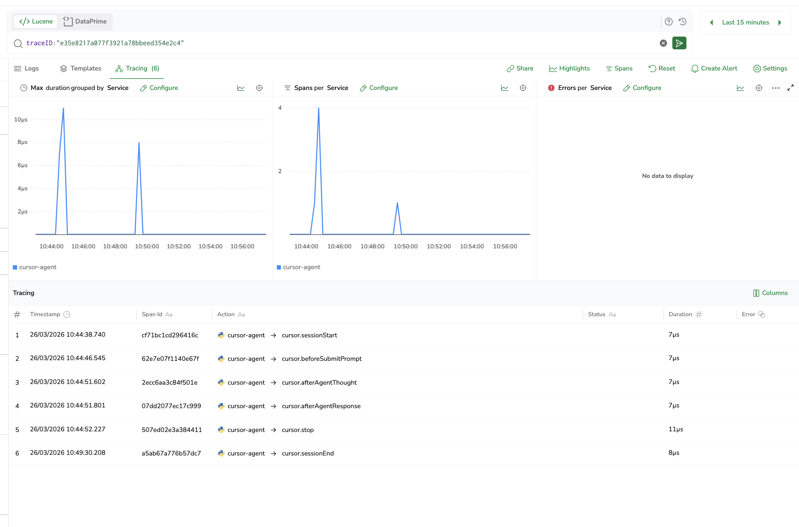
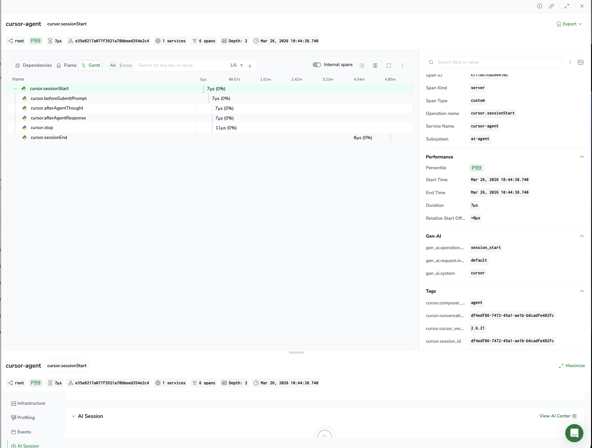

# Cursor - Coralogix

Ship every Cursor agent session — prompts, tool calls, shell executions, file edits, and MCP calls — directly into Coralogix as OTLP traces.

No proxy. No code changes. No change to how developers use Cursor. This integration uses Cursor's native agent hooks system: a Python script converts each hook event into an OTLP protobuf span and sends it directly to your Coralogix ingress endpoint.

---

## How it works

Cursor exposes a `~/.cursor/hooks.json` file that registers a command to run at every agent lifecycle event (prompt submitted, tool called, shell command run, file edited, and so on). Each hook receives a JSON payload on stdin describing the event.

An [OTLP](https://opentelemetry.io/docs/specs/otlp/) **span** represents one such event. A **trace** is the set of spans that share a single ID (`traceId`), representing one end-to-end operation — here, one Cursor agent session.

```
Cursor agent event
      │
      ▼
~/.cursor/hooks/coralogix_hook.sh   (a small wrapper script that loads
      │                              the credentials and starts the hook)
      ▼
extension/resources/hook.py         (Python: stdin → OTLP protobuf span → POST /v1/traces)
      │
      ▼
Coralogix OTLP endpoint
```

On Windows, `hooks.json` runs `coralogix_hook.cmd`, which starts PowerShell (`coralogix_hook.ps1`) to load the credentials and run the same `hook.py`.

Every hook event becomes one span. All spans generated during a session share the same `traceId`, with `cursor.sessionStart` as the root span — so each Cursor agent session (one conversation, from start to end) appears as a single trace in Coralogix Visual Explorer.

---

## Deployment options

| | Audience | How |
|---|---|---|
| **Install script** (`install.sh` on macOS/Linux, `install.ps1` on Windows) | Individual install or org-wide using MDM | CLI flags, env vars, or a `.env` file |
| **Extension** (`.vsix`) | Individual / GUI | Install in Cursor, enter credentials in Settings UI |
| **Cursor dashboard** (team hooks) | Org-wide on Cursor Enterprise, without MDM | Paste one generated script in the Cursor admin dashboard |

---

## Option 1 — Install script

Both `install.sh` (macOS/Linux) and `install.ps1` (Windows) do the same thing: write your Coralogix credentials to a local env file, copy `hook.py` into `~/.cursor/hooks/`, install its two Python dependencies, and register the hook in `~/.cursor/hooks.json`. Both accept the same configuration — as CLI flags, environment variables, or a `.env` file — and both are safe to re-run (idempotent).

Required configuration, whichever way you provide it:

- **API key** — a Coralogix Send-Your-Data API key
- **Endpoint** — your region's OTLP ingress, `https://ingress.<region>.coralogix.com` (see the [region table](#otlp-ingress-by-region) below)
- **Application name** — how the data is tagged in Coralogix (conventional: `cursor`)
- **Subsystem name** — how the data is tagged in Coralogix (conventional: `cursor-sessions`)

Example `.env` file (works with both installers):

```
CX_API_KEY=<your-send-your-data-api-key>
CX_OTLP_ENDPOINT=https://ingress.<region>.coralogix.com  # see region table below
CX_APPLICATION_NAME=cursor
CX_SUBSYSTEM_NAME=cursor-sessions

# Optional
# Masked by default. Set to false to send full prompt and response text to Coralogix.
CURSOR_MASK_PROMPTS=true
CURSOR_OMIT_PRE_TOOL_USE_SPANS=false
CX_OTLP_DEBUG=false
```

Pick the section below for your platform. Each is self-contained — you don't need to read the other one.

### macOS / Linux (`install.sh`)

Requires Python 3.8+ available as `python3`.

**Local setup with a `.env` file:**

```bash
./install.sh --env-file .env
```

**Local setup with flags:**

```bash
./install.sh --api-key <key> --endpoint https://ingress.<region>.coralogix.com
```

**All options:**

```bash
./install.sh \
  --api-key       <key>      # required (or CX_API_KEY env var)
  --endpoint      <url>      # required — your region's OTLP ingress (see region table below)
  --application   <name>     # required (conventional: cursor)
  --subsystem     <name>     # required (conventional: cursor-sessions)
  --mask-prompts              # optional, replace prompts with [MASKED] (default)
  --no-mask-prompts           # optional, send full prompt/response text
  --omit-pre-tool-use         # optional, skip preToolUse spans
  --debug                     # optional, print the raw event and span/trace IDs to stderr
  --env-file      <path>      # optional, load credentials from a .env file
  --hook-source   <path>      # optional, path to hook.py (default: extension/resources/hook.py next to the script)
  --uninstall                 # remove the hook
  --help                      # show usage
```

**Uninstall:**

```bash
./install.sh --uninstall
```

Files land in `~/.cursor/hooks/` and the hook is registered in `~/.cursor/hooks.json`.

### Windows (`install.ps1`)

Requires Python 3.8+ reachable as `python`, `py -3`, or `python3`. Windows PowerShell 5.1 (preinstalled on Windows 10/11) is enough — no `pwsh` needed.

**Local setup with a `.env` file:**

```powershell
powershell -ExecutionPolicy Bypass -File install.ps1 -EnvFile .env
```

**Local setup with flags:**

```powershell
powershell -ExecutionPolicy Bypass -File install.ps1 -ApiKey <key> -Endpoint https://ingress.<region>.coralogix.com
```

**All options:**

| Flag | Notes |
|---|---|
| `-ApiKey <key>` | required (or `CX_API_KEY` env var) |
| `-Endpoint <url>` | required — your region's OTLP ingress (see region table below) |
| `-Application <name>` | required (conventional: `cursor`) |
| `-Subsystem <name>` | required (conventional: `cursor-sessions`) |
| `-MaskPrompts` | replace prompts with `[MASKED]` (default) |
| `-NoMaskPrompts` | send full prompt/response text |
| `-OmitPreToolUse` | skip `preToolUse` spans |
| `-OtlpDebug` | print the raw event and span/trace IDs to stderr |
| `-EnvFile <path>` | load credentials from a `.env` file |
| `-HookSource <path>` | path to `hook.py` (default: `extension\resources\hook.py` next to the script) |
| `-Uninstall` | remove the hook |
| `-Help` | show usage |

**Uninstall:**

```powershell
powershell -ExecutionPolicy Bypass -File install.ps1 -Uninstall
```

Files land in `%USERPROFILE%\.cursor\hooks\` and the hook is registered in `%USERPROFILE%\.cursor\hooks.json`.

---

### OTLP ingress by region

Both installers require `https://` (or `http://localhost`, `http://127.0.0.1`, or `http://[::1]` for a local collector) — any other scheme is rejected so your API key is never sent in cleartext.

| Domain | OTLP endpoint |
|---|---|
| `us1.coralogix.com` | `https://ingress.us1.coralogix.com` |
| `us2.coralogix.com` | `https://ingress.us2.coralogix.com` |
| `eu1.coralogix.com` | `https://ingress.eu1.coralogix.com` |
| `eu2.coralogix.com` | `https://ingress.eu2.coralogix.com` |
| `ap1.coralogix.com` | `https://ingress.ap1.coralogix.com` |
| `ap2.coralogix.com` | `https://ingress.ap2.coralogix.com` |
| `ap3.coralogix.com` | `https://ingress.ap3.coralogix.com` |

### MDM / org-wide deployment

Both installers work for org-wide MDM deployment (Jamf, Intune, Ansible, SCCM, PDQ, etc.) as well as local setup. Inject credentials via environment variables from your secrets manager rather than hardcoding them in a saved policy, for example:

```bash
CX_API_KEY=xxx CX_OTLP_ENDPOINT=xxx CX_APPLICATION_NAME=cursor CX_SUBSYSTEM_NAME=cursor-sessions ./install.sh
```

```powershell
$env:CX_API_KEY = 'xxx'; $env:CX_OTLP_ENDPOINT = 'xxx'; $env:CX_APPLICATION_NAME = 'cursor'; $env:CX_SUBSYSTEM_NAME = 'cursor-sessions'
powershell -ExecutionPolicy Bypass -File install.ps1
```

The hook installs into the **signed-in user's profile** (`~/.cursor` on macOS/Linux, `%USERPROFILE%\.cursor` on Windows), so the MDM must run the installer in the target user's context — not as root/SYSTEM against the machine.

- **Run the installer in the user's context.** MDM agents execute as root/SYSTEM by default; in that context the installer writes to the root/SYSTEM profile instead of the developer's, so the policy reports success but Cursor never loads the hook. On Jamf, execute the installer as the logged-in user (e.g. `launchctl asuser <uid> sudo -u <user> -H`); on Intune, package the installer as a Win32 app with install behavior set to *User* and assign it to a user group. A suitable detection rule is the presence of `~/.cursor/hooks/coralogix_hook.sh` (macOS/Linux) or `%USERPROFILE%\.cursor\hooks\coralogix_hook.cmd` (Windows).
- **Machine-wide alternative:** Cursor also reads a system-level `hooks.json` (`/Library/Application Support/Cursor/hooks.json`, `C:\ProgramData\Cursor\hooks.json`, `/etc/cursor/hooks.json`), which fits the root/SYSTEM execution model — one installation covers every user of the machine. If you take this route, place `hook.py`, the wrapper, and the env file at a machine path readable by all users, and install the two Python packages machine-wide (for example in a dedicated virtual environment), since a `pip install --user` performed as root/SYSTEM is not visible to other users. We recommend validating system-level hook loading on a single machine before a fleet rollout.
- **Credentials:** inject `CX_API_KEY` and the other required values from your MDM's secrets or variable mechanism rather than hardcoding them in a saved policy.
- **Python 3.8+** must be present on the endpoints (`python3` on macOS/Linux; `python`, `py -3`, or `python3` on Windows); distribute it via MDM if your fleet lacks it. If Python is missing, the hook does nothing and Cursor is unaffected.
- The installers are **idempotent** — safe to re-run on every check-in cycle — and offboarding uses the same script with `--uninstall` / `-Uninstall`.
- **Use a single delivery mechanism per machine.** Combining a per-user install with another delivery of the same hook (machine-wide, or Cursor Enterprise team hooks) results in duplicate spans.

---

## Option 2 — VS Code / Cursor Extension

Install `cursor-coralogix-1.0.0.vsix` from the `extension/` folder via `Cmd+Shift+P → Extensions: Install from VSIX`.

Then:
1. Open Settings and search for `cursorCoralogix`, fill in your API key and select your region endpoint
2. Run `Cmd+Shift+P → Coralogix: Setup hooks`
3. Restart Cursor

The extension provides a status bar indicator and commands to set up, remove, and check hook status without editing any files manually.

To build the `.vsix` from source:

```bash
cd extension
npm install
npx vsce package
```

---

## Option 3 — Cursor dashboard (Enterprise, no MDM)

On Cursor **Enterprise**, an admin can deploy this integration to the whole team
from the Cursor dashboard alone. No MDM policy, no per-developer steps, and new
joiners are covered on their first launch.

A dashboard team hook can only carry a script body: it cannot ship `hook.py`,
cannot `pip install`, and has no env file. So the script you paste is a
*bootstrap* that carries `install.sh` (or `install.ps1`) and `hook.py` inside
itself, gzip + base64, and runs the normal installer once in the background. From
then on it exits in about 2 ms. Cursor watches `hooks.json` and reloads it
automatically, so telemetry starts in the same session without a restart.

```
Cursor dashboard team hook ("Workspace Open")
      │  cloud-distributed to every team member
      ▼
bootstrap body (~17 KB, self-contained, no network fetch)
      │  first run only, detached
      ▼
install.sh / install.ps1  ->  ~/.cursor/hooks/  +  ~/.cursor/hooks.json (18 events)
```

Generate the two script bodies, then paste them into the dashboard:

```bash
./make-team-hook.py \
  --api-key     <your-send-your-data-key> \
  --endpoint    https://ingress.<your-domain> \
  --application cursor \
  --subsystem   cursor-sessions
```

This writes `out/team-hook.unix.sh` (Linux + macOS) and
`out/team-hook.windows.ps1` (Windows). In the Cursor dashboard, open
**Rules, Commands, Hooks -> Hooks -> Add**, set Hook Step to **Workspace Open**,
paste a body into Script Content, and tick the matching Operating Systems. Two
entries are needed because one entry carries one script body.

The API key is embedded in the pasted body, so it is stored in Cursor's cloud and
readable by anyone who can read the dashboard hook. It is an ingest-only
Send-Your-Data key; this is the same exposure an MDM policy variable has.

See **[DASHBOARD-DEPLOY.md](DASHBOARD-DEPLOY.md)** for the full runbook:
prerequisites, region lookup, piloting on a subset of users, machine-side
verification, upgrading, key rotation, uninstall, and troubleshooting.
`verify-windows.ps1` checks a Windows install end to end, and
**[QUERIES.md](QUERIES.md)** has ready DataPrime queries for the resulting spans.

---

## Signals sent to Coralogix

Each Cursor hook event becomes one OTLP trace span, named `cursor.<event>` (for example `cursor.sessionStart`, `cursor.preToolUse`).

| Event | Span name | Key attributes |
|---|---|---|
| `sessionStart` | `cursor.sessionStart` | `gen_ai.request.model`, `cursor.user_email`, `cursor.cursor_version` |
| `sessionEnd` | `cursor.sessionEnd` | `gen_ai.request.model`, `cursor.user_email`, `cursor.cursor_version` |
| `beforeSubmitPrompt` | `cursor.beforeSubmitPrompt` | `cursor.prompt` (masked by default; opt in to full text with `CURSOR_MASK_PROMPTS=false`), `gen_ai.request.model` |
| `preToolUse` | `cursor.preToolUse` | `gen_ai.tool.name`, `cursor.tool_input` |
| `postToolUse` | `cursor.postToolUse` | `gen_ai.tool.name`, `cursor.tool_input`, `cursor.tool_output` |
| `postToolUseFailure` | `cursor.postToolUseFailure` | `gen_ai.tool.name`, `cursor.error` |
| `beforeShellExecution` | `cursor.beforeShellExecution` | `cursor.shell_command`, `cursor.cwd` |
| `afterShellExecution` | `cursor.afterShellExecution` | `cursor.shell_command`, `cursor.cwd`, `cursor.exit_code` |
| `beforeMCPExecution` | `cursor.beforeMCPExecution` | `gen_ai.tool.name`, `peer.service` |
| `afterMCPExecution` | `cursor.afterMCPExecution` | `gen_ai.tool.name`, `peer.service`, `cursor.duration_ms` |
| `beforeReadFile` | `cursor.beforeReadFile` | `cursor.file_path` |
| `afterFileEdit` | `cursor.afterFileEdit` | `cursor.file_path`, `cursor.edit_count`, `cursor.lines_added`, `cursor.lines_deleted` |
| `preCompact` | `cursor.preCompact` | `cursor.context_tokens`, `cursor.context_window_size`, `cursor.context_usage_pct` |
| `stop` | `cursor.stop` | `cursor.status`, `cursor.loop_count` |
| `subagentStart` | `cursor.subagentStart` | `cursor.subagent_id`, `cursor.subagent_type` |
| `subagentStop` | `cursor.subagentStop` | `cursor.status`, `cursor.duration_ms` |
| `afterAgentResponse` | `cursor.afterAgentResponse` | `cursor.text` (masked by default), `cursor.duration_ms` |
| `afterAgentThought` | `cursor.afterAgentThought` | `cursor.text` (masked by default) |

All spans carry `cx.integration.source.type` (`cursor_agent`) and `cx.integration.source.version`, plus, when available: `cursor.conversation_id`, `cursor.generation_id`, `gen_ai.request.model`, `gen_ai.system`, `cursor.user_email`. Every export also carries the `CX-Application-Name` and `CX-Subsystem-Name` values as request headers, which Coralogix uses to tag the ingested data with your application and subsystem names.

---

## Screenshots

**Trace list** — every span in a session grouped by `conversation_id`:



**Waterfall** — full session hierarchy with timing, span attributes, and metadata:



---

## Privacy

Prompts and responses are masked by default — `cursor.prompt` (on `beforeSubmitPrompt`) and `cursor.text` (on `afterAgentResponse` / `afterAgentThought`) are replaced with `[MASKED]` before export. Set `CURSOR_MASK_PROMPTS=false` to send full prompt and response text to Coralogix instead. All other attributes (tool names, file paths, shell commands) are unaffected. Spans still carry `gen_ai.request.model`, prompt length, response lines, and latency when masked.

Set `CURSOR_OMIT_PRE_TOOL_USE_SPANS=true` to skip exporting `cursor.preToolUse` spans. `postToolUse` and `postToolUseFailure` spans are still exported and include `cursor.duration_ms`.

---

## Debugging

Set `CX_OTLP_DEBUG=true` to print the raw event payload, exported trace/span IDs, and export errors to stderr. Cursor captures hook stderr in its Output panel — open via **View → Output** and select the **Hooks** channel.

---

## Requirements

- Python 3.8+
- `opentelemetry-sdk` and `opentelemetry-exporter-otlp-proto-http` pip packages (installed automatically)
- Cursor with agent hooks support (**Cursor Settings → Features → Agent**)
- A Coralogix tenant with a Send-Your-Data API key
