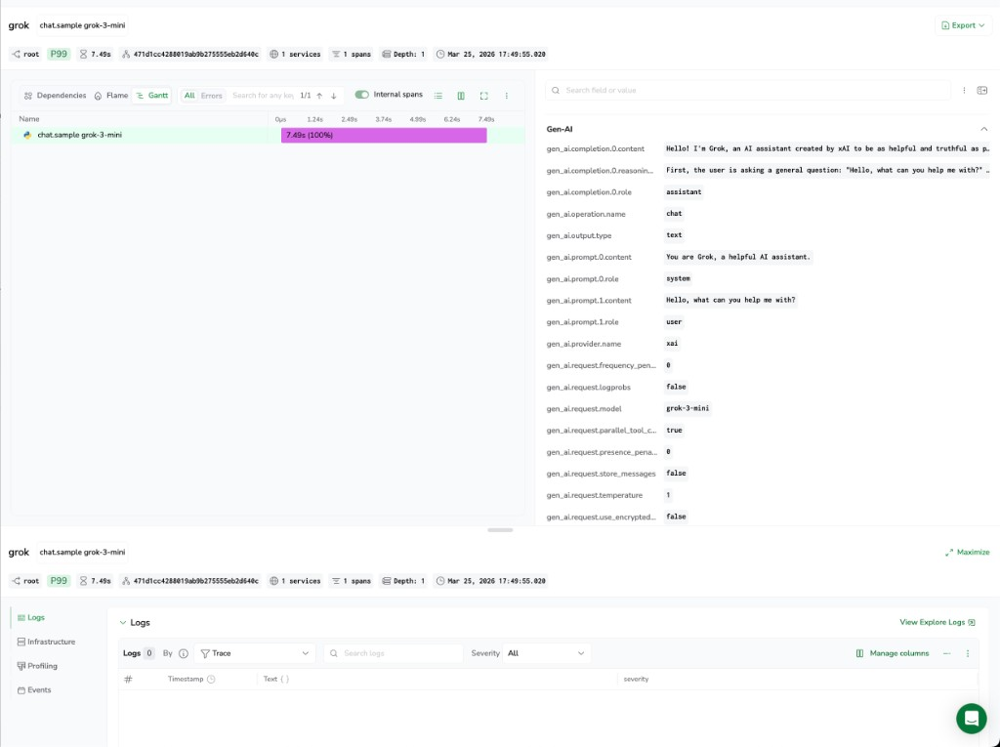

# Grok (xAI) - Coralogix

Ship Grok API telemetry to Coralogix using OpenTelemetry. The `xai-sdk` ships a `Telemetry` class that automatically emits `gen_ai.*` spans for every API call — token usage, model names, finish reasons, and optionally prompt and response content.

---

## How it works

```
Your app  →  xai-sdk  →  api.x.ai
               ↓
        xAI SDK Telemetry  (gen_ai.* spans)
               ↓
        OTLP/HTTP  →  Coralogix ingress  →  Traces
```

---

## Prerequisites

**xAI API key** - from [platform.x.ai](https://platform.x.ai/).

**Coralogix Send-Your-Data API key** - from **Settings - API Keys**.

**OTLP ingress endpoint** for your region:

| Domain | OTLP endpoint |
|---|---|
| `us1.coralogix.com` | `https://ingress.us1.coralogix.com` |
| `us2.coralogix.com` | `https://ingress.us2.coralogix.com` |
| `eu1.coralogix.com` | `https://ingress.eu1.coralogix.com` |
| `eu2.coralogix.com` | `https://ingress.eu2.coralogix.com` |
| `ap1.coralogix.com` | `https://ingress.ap1.coralogix.com` |
| `ap2.coralogix.com` | `https://ingress.ap2.coralogix.com` |
| `ap3.coralogix.com` | `https://ingress.ap3.coralogix.com` |

---

## Setup

### Install

```bash
pip install -r requirements.txt
```

### Configure credentials

```bash
cp .env.example .env
```

Fill in `.env`:

```
XAI_API_KEY=<your-xai-api-key>
CX_API_KEY=<your-send-your-data-api-key>
CX_OTLP_ENDPOINT=https://ingress.eu1.coralogix.com
CX_APPLICATION_NAME=grok
CX_SUBSYSTEM_NAME=grok-api
```

### Run

```bash
set -a && source .env && set +a
python example_llm_tracing.py
```

---

## What you get in Coralogix

Each API call produces one span with operation name `chat.sample <model>`.

### Example trace

In **Tracing**, open a trace from this integration to see the waterfall, span duration, and a **Gen-AI** attribute group: prompts, completions (including `reasoning_content` for `grok-3-mini`), model name, provider, and request parameters such as `temperature` and sampling flags.



**Token usage**

| Attribute | Example |
|---|---|
| `gen_ai.usage.input_tokens` | `30` |
| `gen_ai.usage.output_tokens` | `151` |
| `gen_ai.usage.reasoning_tokens` | `418` |
| `gen_ai.usage.total_tokens` | `599` |
| `gen_ai.usage.cached_prompt_text_tokens` | `11` |

**Model and request**

| Attribute | Example |
|---|---|
| `gen_ai.provider.name` | `xai` |
| `gen_ai.request.model` | `grok-3-mini` |
| `gen_ai.response.model` | `grok-3-mini` |
| `gen_ai.response.finish_reasons` | `["REASON_STOP"]` |
| `gen_ai.operation.name` | `chat` |
| `server.address` | `api.x.ai` |

**Content** (on by default — see privacy controls below)

| Attribute | Content |
|---|---|
| `gen_ai.prompt.0.role` / `.content` | System prompt |
| `gen_ai.prompt.1.role` / `.content` | User message |
| `gen_ai.completion.0.role` / `.content` | Model response |
| `gen_ai.completion.0.reasoning_content` | Internal reasoning trace (`grok-3-mini` only) |

---

## Privacy controls

Prompt and response content are captured by default. To disable:

```bash
export XAI_SDK_DISABLE_SENSITIVE_TELEMETRY_ATTRIBUTES=1
```

To disable telemetry entirely:

```bash
export XAI_SDK_DISABLE_TRACING=1
```

---

## Related links

- [xAI API documentation](https://docs.x.ai/api)
- [xAI SDK for Python](https://github.com/xai-org/xai-sdk-python)
- [OpenTelemetry gen_ai semantic conventions](https://opentelemetry.io/docs/specs/semconv/gen-ai/)
- [Coralogix Distributed Tracing](https://coralogix.com/docs/user-guides/distributed-tracing/)
