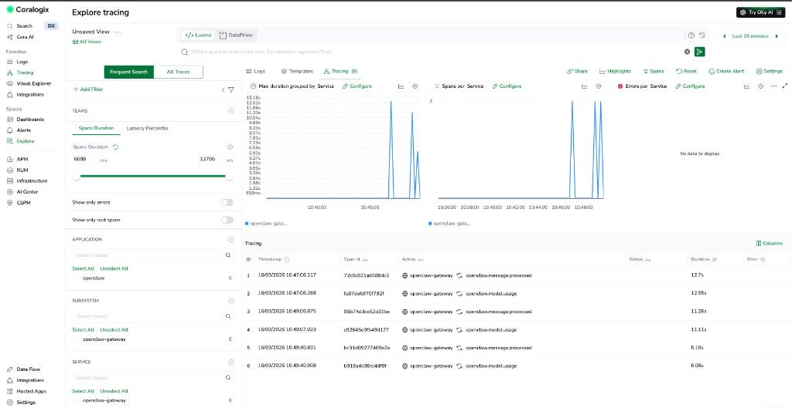
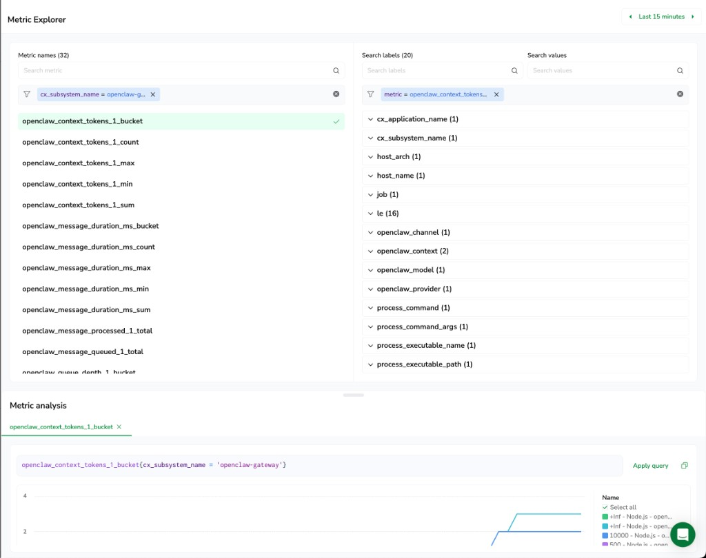

# OpenClaw → Coralogix

Ship every OpenClaw gateway session — token usage, costs, model runs, message flow, webhook activity, and session state - directly into Coralogix using OpenClaw's built-in OpenTelemetry support.

OpenClaw emits OTLP natively via the `diagnostics-otel` plugin; you just point it at your Coralogix ingress endpoint.

---

## How it works

OpenClaw ships a `diagnostics-otel` plugin that emits traces, metrics, and logs when enabled in `~/.openclaw/openclaw.json`. This folder provides:

- `openclaw.json.example` - ready-to-use OpenClaw config with OTel enabled

---

## Signals sent to Coralogix

### Metrics

All metrics appear in **Metrics Explorer** when you search `openclaw`. For the full list of ingested metrics, open Metrics Explorer and filter by `cx_subsystem_name = openclaw-gateway`.

A few key examples:

| OTel metric | Prometheus name in Coralogix | What it tracks |
|---|---|---|
| `openclaw.tokens` | `openclaw_tokens_1_total` | Token usage (`openclaw_token`, `openclaw_model`, `openclaw_provider`, `openclaw_channel`) |
| `openclaw.run.duration_ms` | `openclaw_run_duration_ms_{bucket,sum,count,min,max}` | Model run duration |
| `openclaw.message.processed` | `openclaw_message_processed_1_total` | Messages processed per channel and outcome |
| `openclaw.queue.depth` | `openclaw_queue_depth_1_{bucket,sum,count,min,max}` | Command queue depth per lane |
| `openclaw.session.state` | `openclaw_session_state_1_total` | Session state transitions |

### Traces

Trace spans are exported for every model run, webhook, and message processing event. Filter in **Tracing** by service name `openclaw-gateway`.

| Span | Key attributes |
|---|---|
| `openclaw.model.usage` | `openclaw.tokens.*`, `openclaw.channel`, `openclaw.provider`, `openclaw.model`, `openclaw.sessionId` |
| `openclaw.message.processed` | `openclaw.channel`, `openclaw.outcome`, `openclaw.sessionId` |
| `openclaw.webhook.processed` | `openclaw.channel`, `openclaw.webhook`, `openclaw.chatId` |
| `openclaw.webhook.error` | `openclaw.channel`, `openclaw.webhook`, `openclaw.error` |
| `openclaw.session.stuck` | `openclaw.state`, `openclaw.ageMs`, `openclaw.sessionId` |

### Logs

Structured JSONL logs are exported over OTLP. Query them in **Coralogix Logs** filtered by application name `openclaw` and subsystem `openclaw-gateway`.

---

## Setup

### 1. Install OpenClaw

Follow the [OpenClaw installation guide](https://docs.openclaw.ai/getting-started/installation).

### 2. Configure your Coralogix credentials

Copy the example config:

```bash
cp openclaw.json.example openclaw.json
```

Open `openclaw.json` and fill in the three placeholders:

| Placeholder | Value |
|---|---|
| `<your-region>` | Your Coralogix region (e.g. `eu1`, `us1`, `ap1`) |
| `<your-send-your-data-api-key>` | Your Send-Your-Data API key from **Settings - API Keys** |
| `cx-application-name` / `cx-subsystem-name` | Any name you want to group data under in Coralogix |

**OTLP ingress by region:**

| Domain | OTLP endpoint |
|---|---|
| `us1.coralogix.com` | `https://ingress.us1.coralogix.com` |
| `us2.coralogix.com` | `https://ingress.us2.coralogix.com` |
| `eu1.coralogix.com` | `https://ingress.eu1.coralogix.com` |
| `eu2.coralogix.com` | `https://ingress.eu2.coralogix.com` |
| `ap1.coralogix.com` | `https://ingress.ap1.coralogix.com` |
| `ap2.coralogix.com` | `https://ingress.ap2.coralogix.com` |
| `ap3.coralogix.com` | `https://ingress.ap3.coralogix.com` |

### 3. Apply the OpenClaw config

Copy `openclaw.json` to your OpenClaw config directory and update the credentials:

```bash
cp openclaw.json ~/.openclaw/openclaw.json
```

Open `~/.openclaw/openclaw.json` and replace the placeholder values:

```json
{
  "diagnostics": {
    "otel": {
      "endpoint": "https://ingress.eu1.coralogix.com",
      "headers": {
        "Authorization": "Bearer <your-cx-api-key>",
        "cx-application-name": "openclaw",
        "cx-subsystem-name": "openclaw-gateway"
      }
    }
  }
}
```

### 4. Enable the plugin and start the gateway

```bash
openclaw plugins enable diagnostics-otel
openclaw gateway run
```

Alternatively, the plugin is already enabled in the example config via the `plugins.entries` block — no separate command needed if you copied `openclaw.json.example` directly.

---

## Verify data is flowing

After starting the gateway and running a session:

1. **Metrics** — Go to **Metrics Explorer** and search for `openclaw`. Token and cost metrics appear within one flush interval (default 60 seconds, lower to `10000` for testing).
2. **Traces** — Go to **Tracing** and filter by service name `openclaw-gateway`.
3. **Logs** — Go to **Logs** and filter by application name `openclaw` and subsystem `openclaw-gateway`.





To reduce the flush interval during testing, add to the `otel` block:

```json
"flushIntervalMs": 10000
```

---

## Advanced configuration

| Setting | Default | Purpose |
|---|---|---|
| `diagnostics.otel.flushIntervalMs` | `60000` ms | How often metrics and logs are flushed |
| `diagnostics.otel.sampleRate` | `1.0` | Trace sampling rate (0.0–1.0, root spans only) |
| `diagnostics.otel.traces` | `true` | Enable/disable trace export |
| `diagnostics.otel.metrics` | `true` | Enable/disable metric export |
| `diagnostics.otel.logs` | `false` | Enable OTLP log export (can be high volume) |
| `diagnostics.flags` | — | Enable targeted debug logs without raising global log level |

---

## Related links

- [OpenClaw logging and diagnostics documentation](https://docs.openclaw.ai/logging)
- [OpenClaw diagnostics flags reference](https://docs.openclaw.ai/diagnostics/flags)
- [Coralogix Metrics Explorer](https://coralogix.com/docs/user-guides/metrics/metrics-explorer/)
- [Coralogix Distributed Tracing](https://coralogix.com/docs/user-guides/distributed-tracing/)
