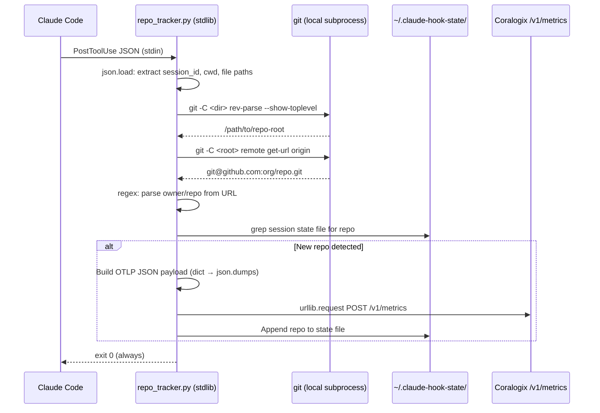
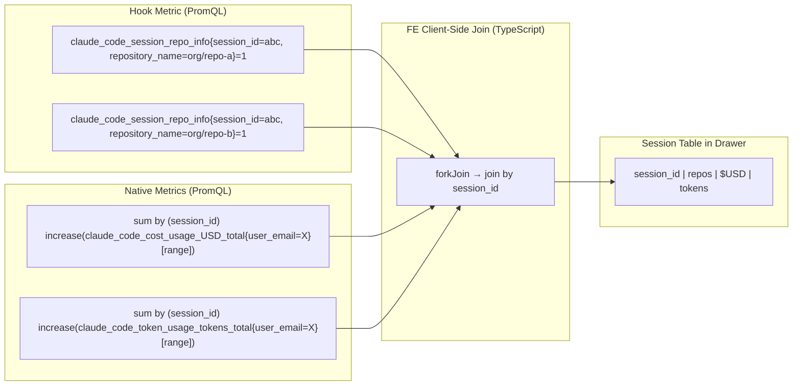

# Plan: Add Repo Name to Code Agent Telemetry via Claude Hook

| Field | Value |
|-------|-------|
| Status | in-progress |
| Created | 2026-05-19 |
| Ticket | AIC-566 |
| Branch | feat/repo-name-hook |

## Context

Claude Code's native OTLP telemetry emits `session_id`, `user_email`, cost, and token metrics — but no repository information. The FE Code Agents dashboard can only show per-user totals, not which repos drive the cost. We need a Claude Code hook that detects repo names from actual file operations and emits a metric with `session_id + repository_name` labels. The FE then queries two PromQL series (native cost/tokens + hook repo info) and joins them client-side by `session_id` to render a session breakdown table: `session_id | repo(s) | USD | tokens`.

**Key constraints:**
- Claude Code's native metrics are emitted by its built-in SDK — we cannot add labels to them
- Sessions can span multiple repos via `add-dir`, editing files in other folders, or opening Claude in a multi-repo parent directory
- Repo detection must work per-tool-event based on actual file paths, not just the starting cwd
- The hook emits a **metric** (not span/log) so the FE queries everything via PromQL
- **Zero external dependencies** — Python 3 stdlib only (json, os, subprocess, urllib.request, configparser). No pip installs.
- **Easy org-wide deployment** — configurable via Claude Code Managed Settings (admin console) so developers don't need to do anything

## Architecture Decisions

- **Signal type: OTLP metric (gauge)** — An info-style gauge `claude_code_session_repo_info` always set to `1`, with labels `{session_id, repository_name, user_email}`. Standard OpenTelemetry "info metric" pattern for label enrichment.
- **Implementation: Python 3 stdlib only** — Single `.py` file. Uses `json` (parse stdin + build OTLP payload), `subprocess` (git commands), `urllib.request` (HTTP POST), `os` (file paths, state dir). No pip installs — Python 3 ships on every macOS/Linux dev machine.
- **Repo detection: `git rev-parse --show-toplevel` + `git remote get-url origin`** — Fast local git operations via `subprocess.run()`. The hook extracts file paths from each tool event and resolves them to repos. Falls back to directory basename if no remote.
- **Multi-repo tracking** — Per-session state file (`~/.claude-hook-state/<session_id>.repos`) tracks repos already emitted. New repo detected → emit metric + append to state. Already seen → skip immediately.
- **OTLP export: `urllib.request` POST to `/v1/metrics`** — Hand-crafted OTLP JSON payload. No SDK needed — the JSON structure for a gauge is fixed and simple.
- **Deployment: Managed Settings (admin console)** — The hook + env vars can be pushed org-wide via Claude Code's managed policy settings. One JSON blob in the admin console, zero per-developer setup. Also supports per-developer install via `install.sh`.
- **FE join strategy: Client-side join** — FE fetches `cost/tokens by session_id` (PromQL on native metrics) and `repo by session_id` (PromQL on hook metric) separately, joins in TypeScript by `session_id`.
- **Hook event: `PostToolUse`** — Fires after every tool call. Uses both `cwd` (top-level field, always present) and `tool_input.file_path` (for Read/Edit/Write) to detect repos.

## Verified Hook Event Schema

From the Claude Code hooks documentation, PostToolUse events have this JSON structure on stdin:

```json
{
  "session_id": "abc123",
  "cwd": "/home/user/my-project",
  "hook_event_name": "PostToolUse",
  "tool_name": "Edit",
  "tool_input": {
    "file_path": "/home/user/my-project/src/main.py",
    "old_string": "...",
    "new_string": "..."
  },
  "tool_use_id": "unique-id",
  "tool_result": { ... },
  "transcript_path": "/home/user/.claude/projects/.../transcript.jsonl",
  "permission_mode": "default"
}
```

**File path extraction per tool:**

| tool_name | Path source | Field |
|-----------|-------------|-------|
| `Read`, `Edit`, `Write`, `NotebookEdit` | Specific file | `tool_input.file_path` |
| `Bash` | Working directory | `cwd` (top-level) |
| `Glob`, `Grep` | Search root | `tool_input.path` (optional, falls back to `cwd`) |
| All others | Session directory | `cwd` (top-level) |

## Diagrams





## OTLP JSON Payload Format

Built as a Python dict and serialized via `json.dumps()`:

```json
{
  "resourceMetrics": [{
    "resource": {
      "attributes": [
        {"key": "service.name", "value": {"stringValue": "claude-code-hook"}},
        {"key": "cx.application.name", "value": {"stringValue": "<CX_APPLICATION_NAME>"}},
        {"key": "cx.subsystem.name", "value": {"stringValue": "<CX_SUBSYSTEM_NAME>"}}
      ]
    },
    "scopeMetrics": [{
      "scope": {"name": "repo-tracker", "version": "1.0.0"},
      "metrics": [{
        "name": "claude_code_session_repo_info",
        "gauge": {
          "dataPoints": [{
            "asInt": "1",
            "timeUnixNano": "<epoch_ns>",
            "attributes": [
              {"key": "session_id", "value": {"stringValue": "<session_id>"}},
              {"key": "repository_name", "value": {"stringValue": "<owner/repo>"}},
              {"key": "user_email", "value": {"stringValue": "<email>"}}
            ]
          }]
        }
      }]
    }]
  }]
}
```

## Deployment Options

### Option A — Org-wide via Managed Settings (recommended)

Admin pastes this into **Claude.ai → Admin Settings → Claude Code → Managed Settings**:

```json
{
  "hooks": {
    "PostToolUse": [
      {
        "hooks": [
          {
            "type": "command",
            "command": "python3 ~/.claude/hooks/repo_tracker.py"
          }
        ]
      }
    ]
  },
  "env": {
    "CX_HOOK_API_KEY": "<YOUR_CX_API_KEY>",
    "CX_HOOK_OTLP_ENDPOINT": "https://ingress.<region>.coralogix.com",
    "CX_HOOK_APPLICATION_NAME": "claude-code",
    "CX_HOOK_SUBSYSTEM_NAME": "ai-agent"
  }
}
```

This can be combined with the existing telemetry env vars (CLAUDE_CODE_ENABLE_TELEMETRY etc.) in the same managed settings block. The `CX_HOOK_*` prefix avoids colliding with the native OTLP env vars.

The installer (`install.sh`) just copies `repo_tracker.py` to `~/.claude/hooks/`. Or: the managed settings can reference a URL/path where the script is hosted.

### Option B — Per-developer install

```bash
./install.sh                          # interactive: prompts for API key
CX_API_KEY=xxx ./install.sh           # non-interactive
./install.sh --env-file .env          # from env file
```

## Milestones Overview

1. **Repo-Tracking Hook** — A Python stdlib Claude Code hook that detects repos from file operations via git and emits an OTLP JSON gauge metric per session+repo pair
2. **FE Session Breakdown Table** — PromQL queries + client-side join + session table in the user drawer

---

## Milestone 1: Repo-Tracking Hook

**Why this matters:** Platform teams need repo-level cost attribution. Without it, the Code Agents dashboard shows "$X spent by user Y" but can't answer "which repos drove that cost?" This blocks chargeback workflows and makes it impossible to measure AI ROI per project.

**Success criteria:** After installing the hook and running a Claude Code session that edits files in a git repo, querying `claude_code_session_repo_info` in Coralogix Metrics Explorer returns a series with the correct `session_id` and `repository_name` labels.

**Key decisions:**
- **Python 3 stdlib only** — `json`, `os`, `subprocess`, `urllib.request`, `re`, `time`. No pip. Python 3 is on every macOS/Linux dev machine.
- **Info gauge pattern** — Gauge always `1`, labels carry the data. FE reads label values via PromQL.
- **OTLP/HTTP JSON via urllib.request** — `urllib.request.urlopen(Request(...))`. No curl, no SDK.
- **Session state as flat file** — `~/.claude-hook-state/<session_id>.repos`: newline-delimited repo names. Check with `open().read()`, append with `open('a')`.
- **Git subprocess for repo detection** — `subprocess.run(['git', '-C', dir, ...], capture_output=True)`. Fast local ops, no network.
- **Env var prefix: `CX_HOOK_*`** — Avoids collision with Claude Code's native `OTEL_*`/`CX_*` vars. `CX_HOOK_API_KEY`, `CX_HOOK_OTLP_ENDPOINT`, etc.
- **Silent failures** — Every code path wrapped in try/except. Hook must never block Claude Code or produce visible errors.

### Deliverable Spec

| Artifact | Description |
|----------|-------------|
| `claude-code/hooks/repo_tracker.py` | Self-contained hook script (~120 lines). Reads PostToolUse JSON from stdin, resolves repos via git, emits OTLP gauge metric via urllib |
| `claude-code/hooks/install.sh` | Copies script, registers hook in settings.json, creates state dir. Supports both per-dev and MDM deployment |
| `claude-code/hooks/.env.example` | Template: `CX_HOOK_API_KEY`, `CX_HOOK_OTLP_ENDPOINT`, `CX_HOOK_APPLICATION_NAME`, `CX_HOOK_SUBSYSTEM_NAME` |
| Managed settings JSON snippet | Copy-paste block for the admin console (hook registration + env vars) |

**Metric emitted:**

| Name | Type | Value | Labels |
|------|------|-------|--------|
| `claude_code_session_repo_info` | Gauge | `1` | `session_id`, `repository_name`, `user_email` |

**Repo detection logic:**

1. Parse stdin JSON: extract `session_id`, `cwd`, `tool_name`, `tool_input`
2. Collect paths to check:
   - Always: `cwd` (present on every event)
   - If tool_name is Read/Edit/Write/NotebookEdit: also `tool_input.file_path`
   - If tool_name is Glob/Grep: also `tool_input.path` (if present)
3. For each path: `subprocess.run(['git', '-C', dirname, 'rev-parse', '--show-toplevel'])`
4. For each repo root: `subprocess.run(['git', '-C', root, 'remote', 'get-url', 'origin'])`
5. Parse `owner/repo` from URL via `re.search(r'[:/]([^/]+/[^/]+?)(?:\.git)?$', url)`
6. Fallback: `os.path.basename(repo_root)` if no remote
7. Check state file → emit metric only for new repos

### 1.1 [x] Core hook script — repo detection and OTLP metric emission *(completed 2026-05-19)*
- **Files:** `claude-code/hooks/repo_tracker.py`
- **What:** Create the Python 3 stdlib-only hook script that:
  1. Reads PostToolUse hook event JSON from stdin via `json.load(sys.stdin)`
  2. Extracts `session_id` from the event (top-level field). Exit if missing.
  3. Reads env vars: `CX_HOOK_API_KEY`, `CX_HOOK_OTLP_ENDPOINT` (default `https://ingress.eu2.coralogix.com`), `CX_HOOK_APPLICATION_NAME` (default `claude-code`), `CX_HOOK_SUBSYSTEM_NAME` (default `ai-agent`). Exit silently if API key not set.
  4. Collects file paths to check for repos:
     - Always includes `cwd` (top-level field, always present)
     - For `Read`/`Edit`/`Write`/`NotebookEdit`: adds `tool_input.file_path`
     - For `Glob`/`Grep`: adds `tool_input.path` if present
  5. For each unique directory, resolves repo name:
     - `subprocess.run(['git', '-C', dir, 'rev-parse', '--show-toplevel'], capture_output=True, timeout=5)`
     - `subprocess.run(['git', '-C', root, 'remote', 'get-url', 'origin'], capture_output=True, timeout=5)`
     - Parse `owner/repo` from URL via regex (handles SSH and HTTPS)
     - Fallback: `os.path.basename(repo_root)` if no remote
  6. Checks session state file `~/.claude-hook-state/<session_id>.repos`:
     - If file contains the repo name → skip
     - Otherwise → append repo name
  7. Builds OTLP JSON gauge payload as Python dict, serializes via `json.dumps()`
  8. POSTs via `urllib.request.urlopen(Request(url, data, headers))` with 5-second timeout
  9. Creates `~/.claude-hook-state/` directory if missing (`os.makedirs(..., exist_ok=True)`)
  10. Entire `main()` wrapped in `try: ... except: sys.exit(0)` — never crashes, never blocks
  11. Optional: if `CX_HOOK_DEBUG=1`, prints debug info to stderr

  The script must be self-contained — no imports beyond stdlib, no external files needed at runtime.
- **Acceptance:**
  1. In a git repo: `echo '{"session_id":"test-123","cwd":"/path/to/repo","hook_event_name":"PostToolUse","tool_name":"Bash","tool_input":{"command":"ls"}}' | CX_HOOK_DEBUG=1 python3 repo_tracker.py` → prints OTLP payload to stderr with correct session_id and repository_name
  2. State file `~/.claude-hook-state/test-123.repos` contains the repo name
  3. Run again → no HTTP POST (repo already in state file)
  4. With file_path in a different repo → new POST, state file updated
  5. Outside a git repo → exits 0, no error output
  6. Without `CX_HOOK_API_KEY` set → exits 0 immediately, no error
  7. With unreachable endpoint → exits 0 (urllib timeout caught)
- **Dependencies:** None

### 1.2 [x] Installer script and managed settings snippet *(completed 2026-05-19)*
- **Files:** `claude-code/hooks/install.sh`, `claude-code/hooks/.env.example`
- **What:** Create:

  **install.sh** — idempotent installer for per-developer setup:
  1. Checks Python 3 is available (`python3 --version`)
  2. Checks `git` is available
  3. Creates `~/.claude/hooks/` directory
  4. Copies `repo_tracker.py` to `~/.claude/hooks/repo_tracker.py`
  5. Registers the hook in `~/.claude/settings.json`:
     - If file doesn't exist, create it with the hook config
     - If file exists, merge the PostToolUse hook without overwriting existing hooks
     - Hook command: `python3 ~/.claude/hooks/repo_tracker.py`
     - Use Python (not jq!) for JSON merging to stay zero-dep
  6. If `CX_HOOK_API_KEY` is set in env or `--env-file` is passed:
     - Write env vars to `~/.claude/hooks/.env`
     - Add `source ~/.claude/hooks/.env` before the python command in the hook, OR document that env vars should be set in managed settings
  7. Creates `~/.claude-hook-state/` directory
  8. Runs a dry-run: pipes test JSON through the script with `CX_HOOK_DEBUG=1` to verify it parses correctly
  9. Prints success message + next steps

  **.env.example:**
  ```
  CX_HOOK_API_KEY=<your-send-your-data-api-key>
  CX_HOOK_OTLP_ENDPOINT=https://ingress.eu2.coralogix.com
  CX_HOOK_APPLICATION_NAME=claude-code
  CX_HOOK_SUBSYSTEM_NAME=ai-agent
  ```

  **Managed settings snippet** in README: a copy-paste JSON block for the admin console that includes both the hook registration and env vars (see "Deployment Options" above).
- **Acceptance:** `./install.sh` → script copied, hook registered, state dir created. Run again → idempotent. `cat ~/.claude/settings.json` shows PostToolUse hook. Dry-run test passes.
- **Dependencies:** 1.1

### 1.3 [x] Documentation *(completed 2026-05-19)*
- **Files:** `claude-code/hooks/README.md`
- **What:** Document:
  1. What the hook does and why (repo-level cost attribution for the AI Center dashboard)
  2. **Org-wide setup (recommended):** Copy-paste the managed settings JSON into the admin console. Done. Include the exact JSON block with placeholders and a region endpoint table.
  3. **Per-developer setup:** `./install.sh` or `CX_HOOK_API_KEY=xxx ./install.sh`
  4. Prerequisites: Python 3, git (both standard on dev machines)
  5. Env vars table: `CX_HOOK_API_KEY`, `CX_HOOK_OTLP_ENDPOINT`, `CX_HOOK_APPLICATION_NAME`, `CX_HOOK_SUBSYSTEM_NAME`, `CX_HOOK_DEBUG`
  6. Metric emitted: name, type, labels, example PromQL
  7. How repo detection works: per-tool-event file paths → git → owner/repo
  8. Multi-repo sessions: each new repo = new metric series
  9. Privacy: only repo names and session IDs, never code content
  10. Verification: PromQL query to run in Coralogix Metrics Explorer
  11. Troubleshooting: no git remote, Python not found, endpoint unreachable, state file cleanup
- **Acceptance:** README covers both deployment paths (admin console + per-dev). Managed settings JSON block is copy-paste ready. All env vars documented.
- **Dependencies:** 1.1, 1.2

---

## Milestone 2: FE Session Breakdown Table

**Why this matters:** The data is flowing, but without the FE table, nobody can see it. Engineering managers clicking into a user's details in the Code Agents dashboard will now see a per-session breakdown showing which repos each session worked on, alongside cost and token counts. This is the "where did the money go?" view.

**Success criteria:** Click a user in the Claude Code Users bar chart → drawer opens → a "Sessions" card shows a table with columns: Session ID, Repos, Cost (USD), Tokens. Sessions with hook data show repo names; sessions without show "—". Data matches the native metric totals.

**Key decisions:**
- **Client-side join, not PromQL join** — Avoids `group_left` cost-duplication with multi-repo sessions. The FE already uses `forkJoin` for parallel queries.
- **Three PromQL queries per drawer open** — `costBySession`, `tokensBySession` (native metrics grouped by session_id), `reposBySession` (hook metric grouped by session_id, repository_name).
- **Table in existing drawer** — Extends `ClaudeCodeUserDialogComponent`, no new page/route.
- **Graceful degradation** — If hook metric doesn't exist (not installed), the repos column shows "—" but cost/tokens still render from native metrics.

### Deliverable Spec

**New PromQL queries:**

| Query name | PromQL | Returns |
|------------|--------|---------|
| `costBySession` | `sum by (session_id) (increase(claude_code_cost_usage_USD_total{user_email="X", ...filters}[<range>s]))` | Map of session_id -> cost USD |
| `tokensBySession` | `sum by (session_id) (increase(claude_code_token_usage_tokens_total{user_email="X", ...filters}[<range>s]))` | Map of session_id -> token count |
| `reposBySession` | `max by (session_id, repository_name) (claude_code_session_repo_info{...filters})` | List of (session_id, repository_name) pairs |

**Client-side join logic (TypeScript):**
```typescript
// 1. Fetch all three in parallel via forkJoin
const costMap: Map<string, number>   // session_id -> cost
const tokenMap: Map<string, number>  // session_id -> tokens
const repoMap: Map<string, string[]> // session_id -> [repo_name, ...]

// 2. Build rows from costMap (authoritative session list, already user-filtered)
const rows: SessionBreakdownRow[] = [];
for (const [sessionId, cost] of costMap) {
  rows.push({
    sessionId,
    repos: repoMap.get(sessionId)?.join(', ') ?? '—',
    costUsd: cost,
    tokens: tokenMap.get(sessionId) ?? 0,
  });
}

// 3. Sort by cost desc, limit 50
rows.sort((a, b) => b.costUsd - a.costUsd);
return rows.slice(0, 50);
```

**Extracting repo pairs from PromQL response:**
```typescript
// reposBySession returns vector where each result has metric.session_id + metric.repository_name
const repoMap = new Map<string, string[]>();
for (const result of response.data.result) {
  const sid = result.metric['session_id'];
  const repo = result.metric['repository_name'];
  if (!repoMap.has(sid)) repoMap.set(sid, []);
  repoMap.get(sid)!.push(repo);
}
```

**UI table:**

| Column | Format | Source |
|--------|--------|--------|
| Session ID | First 8 chars, full ID in tooltip | session_id label |
| Repos | Comma-separated, or "—" | repository_name from hook metric |
| Cost | `$X.XX` | costBySession |
| Tokens | Abbreviated (e.g. `1.2M`) | tokensBySession |

### 2.1 [ ] Add per-session PromQL queries
- **Files:** `libs/ai-center/code-agents/src/lib/promql-queries.ts` (in cx-web-workspace)
- **What:** Add three new query builders to `codeAgentsPromQLQueries`:
  1. `costBySession(filters)` — `sum by (session_id) (increase(claude_code_cost_usage_USD_total{user_email="...", ...}[<range>s]))`. Requires `user` in filters.
  2. `tokensBySession(filters)` — `sum by (session_id) (increase(claude_code_token_usage_tokens_total{user_email="...", ...}[<range>s]))`. Requires `user` in filters.
  3. `reposBySession(filters)` — `max by (session_id, repository_name) (claude_code_session_repo_info{...})`. Uses `max` (not `increase`) since it's a gauge. Apply `cx_application_name`/`cx_subsystem_name` filters if present. Does NOT filter by `user_email` (hook may not carry it). Client-side join handles user scoping.

  Use existing `buildLabelFilter` helper. Use `getFullRangeSeconds()` for range window.
- **Acceptance:** `costBySession({user: 'dev@co.com'})` returns `sum by (session_id) (increase(claude_code_cost_usage_USD_total{user_email="dev@co.com"}[86400s]))`. All three return valid PromQL strings.
- **Dependencies:** None (pure query builders)

### 2.2 [ ] Session breakdown service and types
- **Files:** New: `libs/ai-center/code-agents/src/lib/code-agents-claude-code/claude-code-users/claude-code-sessions.service.ts`, `libs/ai-center/code-agents/src/lib/code-agents-claude-code/claude-code-users/claude-code-sessions.types.ts` (in cx-web-workspace)
- **What:** Create a new service following Pattern B (per-panel):

  Types (`claude-code-sessions.types.ts`):
  ```typescript
  export interface SessionBreakdownRow {
    sessionId: string;
    repos: string;     // comma-separated repo names, or "—"
    costUsd: number;
    tokens: number;
  }
  ```

  Service `ClaudeCodeSessionsService`:
  1. Inject `PrometheusQueryService`
  2. Method `getSessionBreakdown(filters: QueryFilters & { user: string }): Observable<SessionBreakdownRow[]>`
  3. `forkJoin` three queries in parallel
  4. Extract cost/token maps via `extractLabeledValues('session_id')`
  5. Extract repo map by iterating `response.data.result` and grouping `(metric.session_id, metric.repository_name)`
  6. Join, sort, limit as shown in client-side join logic
  7. `catchError` on repos query → empty map (graceful degradation)
- **Acceptance:** Service compiles. Returns `SessionBreakdownRow[]`. Repos defaults to "—" when hook metric absent.
- **Dependencies:** 2.1

### 2.3 [ ] Session table in user drawer
- **Files:** `claude-code-user-dialog.component.ts`, `claude-code-user-dialog.component.html`, `claude-code-users.component.ts` (in `libs/ai-center/code-agents/src/lib/code-agents-claude-code/claude-code-users/` in cx-web-workspace)
- **What:** Extend the existing user drawer:

  1. Add `sessions: SessionBreakdownRow[]` to `ClaudeCodeUserDialogData`
  2. In `ClaudeCodeUsersComponent`:
     - Inject `ClaudeCodeSessionsService`
     - Add `rxResource` for session breakdown when user selected
     - Pass sessions into `#userDialogData` computed signal
  3. In `ClaudeCodeUserDialogComponent` template:
     - New `<cxui-card>` below model breakdown: "Sessions"
     - HTML table: Session ID (8 chars + tooltip), Repos, Cost ($X.XX), Tokens (abbreviated)
     - Empty state: "No session data available"
     - `max-height: 300px; overflow-y: auto` for scrolling
  4. Add i18n keys for column headers and empty state

  Match existing drawer card styling exactly.
- **Acceptance:** User drawer shows Sessions table. Repos column shows repo names or "—". Table scrolls for many sessions.
- **Dependencies:** 2.2
